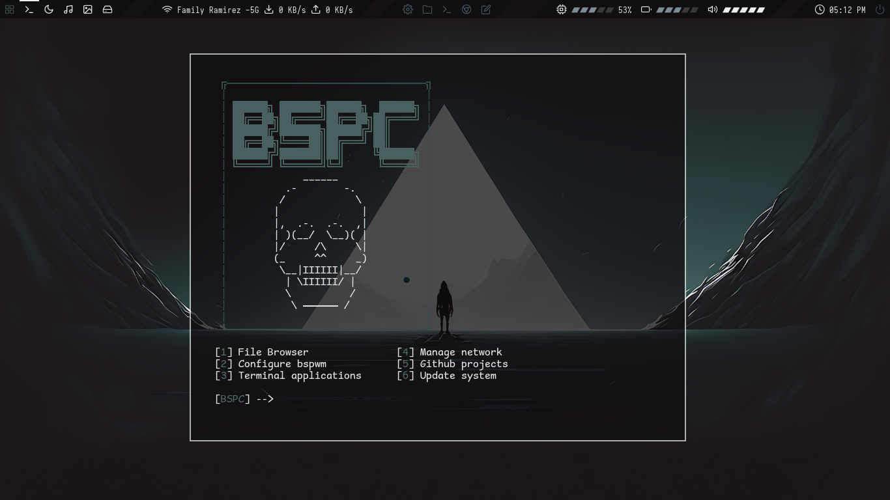
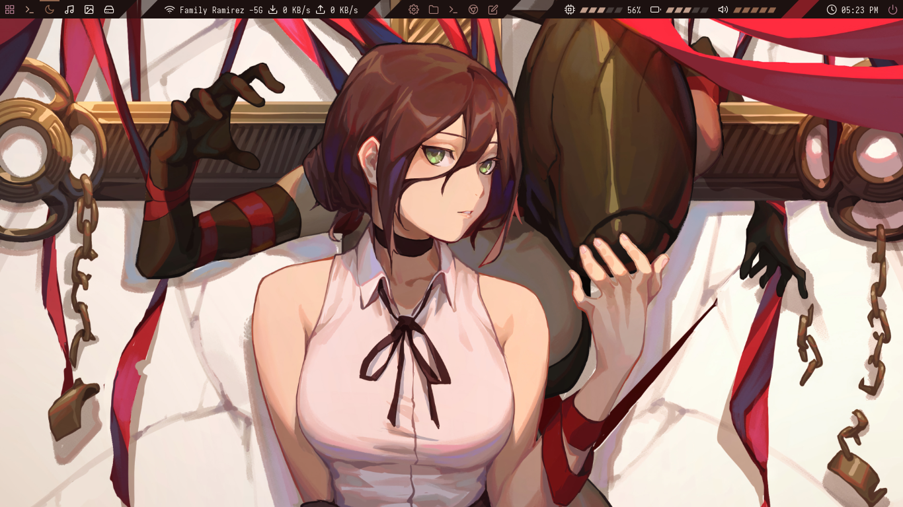

|  |
| ---------------------------------------------------------------------------------------------- |

## BSPWM | Professional bspwm desktop environment for [kali linux](https://www.kali.org/)

8 different themes for [**BSPWM**](https://github.com/baskerville/bspwm.git) and [**Polybar**](https://github.com/polybar/polybar.git), With a **Theme selector** and to **Mode Selector** change on the fly.

## Software

This configuration uses the following software.

- **WM:** [bspwm](https://github.com/baskerville/bspwm.git)
- **Hotkey:** [sxhkd](https://github.com/baskerville/sxhkd)
- **Locker:** [betterlockscreen](https://github.com/betterlockscreen/betterlockscreen)
- **Shell:** [zsh](https://www.zsh.org/)
- **Bars:** [polybar](https://github.com/polybar/polybar) | [cuts](https://github.com/adi1090x/polybar-themes#cuts)
- **Compositor:** [picom](https://github.com/yshui/picom)
- **File Manager:** [thunar](https://docs.xfce.org/xfce/thunar/start) | [nautilus](https://wiki.gnome.org/action/show/Apps/Files?action=show&redirect=Apps%2FNautilus)
- **Font terminal:** [comicmono](https://dtinth.github.io/comic-mono-font/)
- **Fonts:** [iosevka](https://github.com/ryanoasis/nerd-fonts/tree/master/patched-fonts/Iosevka) | [hack](https://github.com/ryanoasis/nerd-fonts/tree/master/patched-fonts/Hack)
- **Application Launcher:** [rofi](https://github.com/davatorium/rofi)
- **Browsers:** [firefox](https://www.mozilla.org/en-US/firefox/new/) | [google-chrome](https://www.google.com/intl/es-419/chrome/)
- **Terminal:** [kitty](https://sw.kovidgoyal.net/kitty/)
- **Static Wallpaper:** [feh](https://github.com/derf/feh) | [nitrogen](https://wiki.archlinux.org/title/nitrogen)
- **Screenshot:** [flameshot](https://flameshot.org/)
- **Color Scheme:** [theaming](https://github.com/AlvinPix/bspwm/blob/main/scripts/Theaming.sh)
- **Default Theme:** [xavier](https://github.com/AlvinPix/bspwm/tree/main#xavier)

## Overview of the environment

This environment comes with 8 different themes where each theme has its own names and wallpapers, they have their own color range the topics are as follows.

1. [**Zenitsu**](https://github.com/AlvinPix/bspwm/tree/main#zenitsu)
2. [**Raven**](https://github.com/AlvinPix/bspwm/tree/main#raven)
3. [**Simon**](https://github.com/AlvinPix/bspwm/tree/main#simon)
4. [**Camila**](https://github.com/AlvinPix/bspwm/tree/main#camila)
5. [**Ryan**](https://github.com/AlvinPix/bspwm/tree/main#ryan)
6. [**Esmeralda**](https://github.com/AlvinPix/bspwm/tree/main#esmeralda)
7. [**Xavier**](https://github.com/AlvinPix/bspwm/tree/main#xavier)
8. [**Nami**](https://github.com/AlvinPix/bspwm/tree/main#nami)

## Xavier

**Xavier is the default theme during installation**

|  |
| ------------------------------------------------------------ |

## Pentest

|  |  |
| --------------------------------------------------------------------------- | --------------------------------------------------------------------------- |

<details>
<summary><b>Extra wallpapers Xavier</b></summary>

|  |  |  |  |  |  |  |  |  |
| :---------------------------------------------------------------------------------------------: | :---------------------------------------------------------------------------------------------: | :---------------------------------------------------------------------------------------------: | :---------------------------------------------------------------------------------------------: | :---------------------------------------------------------------------------------------------: | :---------------------------------------------------------------------------------------------: | :---------------------------------------------------------------------------------------------: | :---------------------------------------------------------------------------------------------: | :---------------------------------------------------------------------------------------------- |

</details>

## Nami

|  |
| -------------------------------------------------------- |

## Pentest

|  |  |
| ----------------------------------------------------------------------- | ---------------------------------------------------------------------- |

<details>
<summary><b>Extra wallpapers Nami</b></summary>

|  |  |
| :-----------------------------------------------------------------------------------------: | :-----------------------------------------------------------------------------------------: |

</details>

## Custom scripts

For the desktop environment create several custom scripts, one that updates the system, and another to connect to the wifi network using the linux nmcli utility
Another that allows you to change the environment themes.

- 🎨 Switch themes and modes [**theaming**](https://github.com/AlvinPix/bspwm/blob/main/scripts/Theaming.sh)
- 📡 Connect to wifi using nmcli utility [**wifi**](https://github.com/AlvinPix/bspwm/blob/main/scripts/wifi.sh)
- 🖥️ Resize the kitty window to the indicated position [**rezise**](https://github.com/AlvinPix/bspwm/blob/main/scripts/rezise.sh)
- 📦 Update the system in an easy and simple way [**updates**](https://github.com/AlvinPix/bspwm/blob/main/scripts/updates.sh)

## Keyboard shortcuts

All keyboard shortcuts in [**sxhkdrc**](https://github.com/AlvinPix/bspwm/blob/main/.config/sxhkd/sxhkdrc) file.

## Environment installation

To install this desktop environment is very easy, first clone the repository, there will be the cloned repository folder.

```bash
git clone https://github.com/jnjambrin0/Debian-Environment.git ; cd bspwm
```

Finally, chmod permissions to the files called **debian.sh** and **root.sh** and then run it.

```bash
chmod u+x debian.sh root.sh ; ./debian.sh ; sudo ./root.sh
```

Wait for the installation scripts to finish, once finished close section and select the new bspwm desktop.

## Credits

- This environment has been inspired by the functionalities of [**S4vitar's**](https://github.com/s4vitar) environment.
- Thanks to [**adi1090x**](https://github.com/adi1090x) for his contribution to creating polybar [cuts](https://github.com/adi1090x/polybar-themes#cuts).
- Thanks to [**wallhaven**](https://wallhaven.cc/) for their incredible wallpapers, credits to their respective creators.

## Support

<a href="https://www.buymeacoffee.com/alvinpix" target="_blank"></a>
